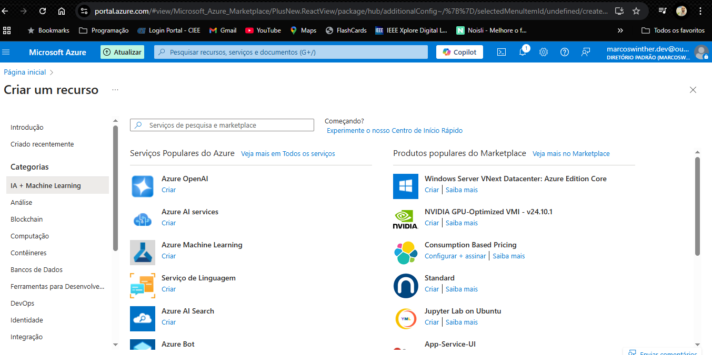
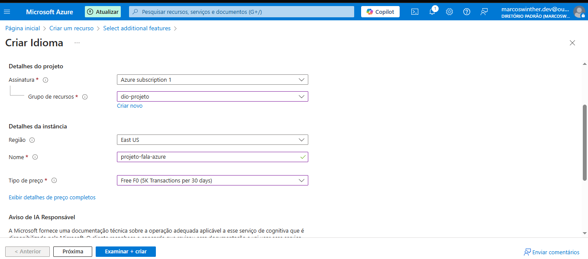
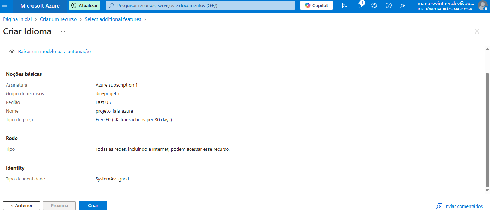
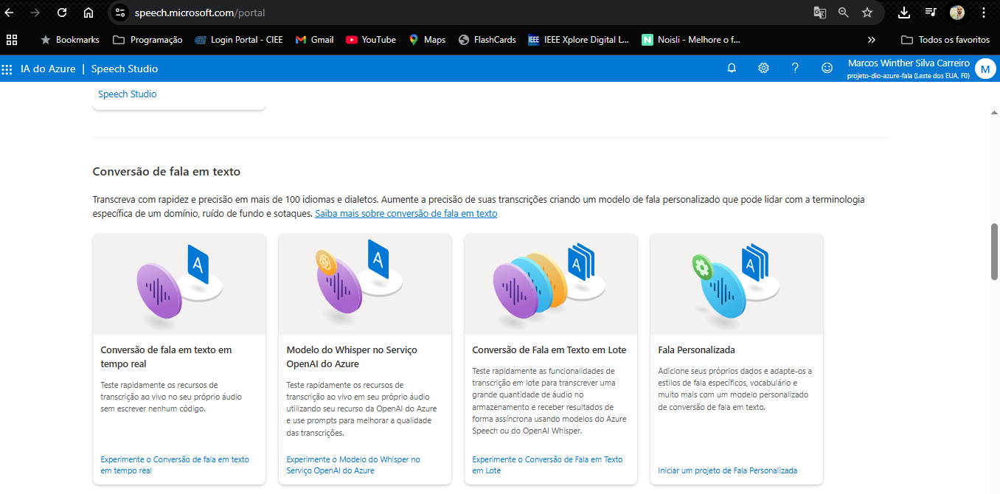
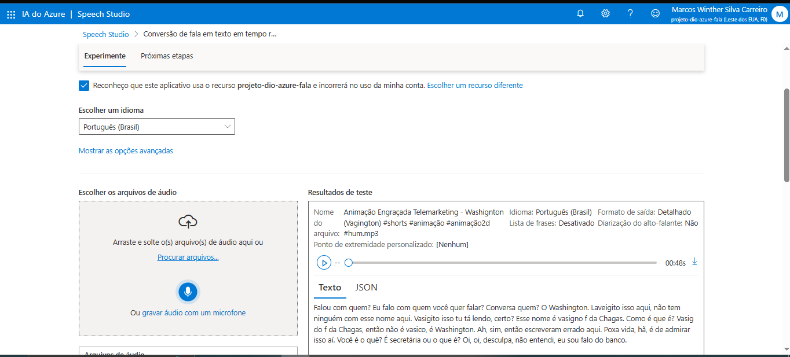
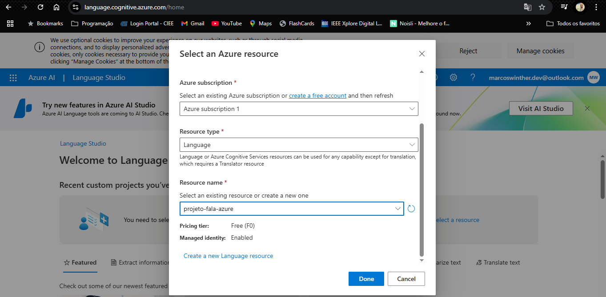
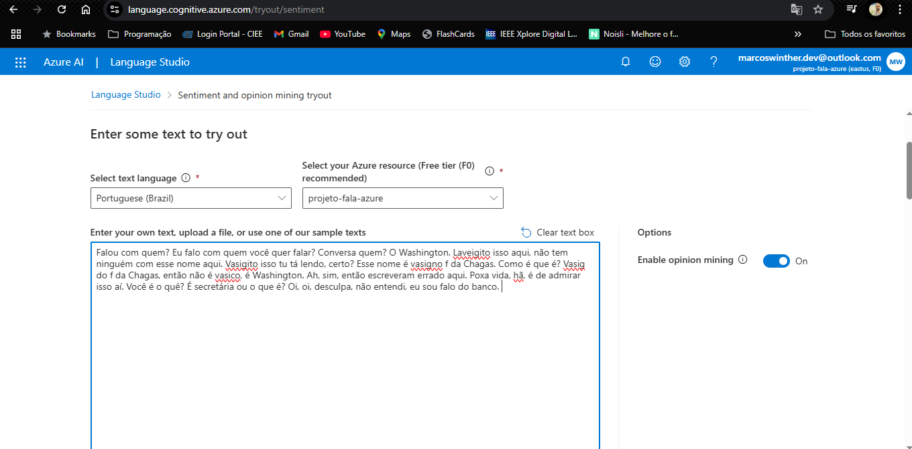
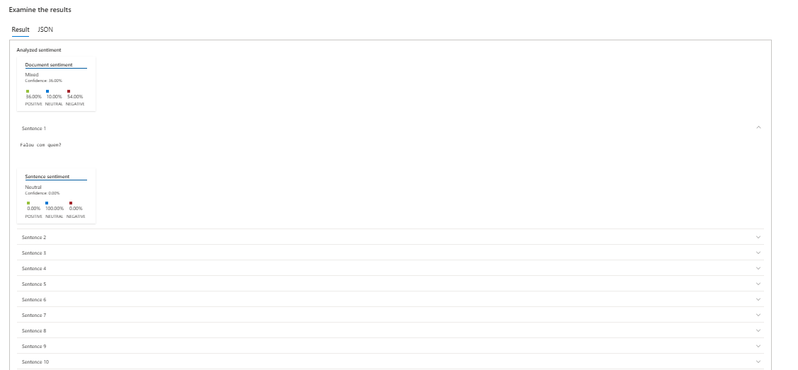

# 🗣️➡️📊 Análise de Sentimentos com Azure AI: Da Fala à Emoção

## ✨ Introdução & Objetivo

Este projeto demonstra o poder das ferramentas de Inteligência Artificial (IA) do Microsoft Azure para analisar o sentimento expresso em linguagem falada. O processo envolve a transcrição de um arquivo de áudio para texto usando o **Azure AI Speech Studio** e, em seguida, a análise do sentimento desse texto usando o **Azure AI Language Studio**.

O objetivo principal é mostrar, de forma prática, como podemos extrair insights valiosos (neste caso, a polaridade emocional - positiva, negativa ou neutra) a partir de dados de áudio não estruturados, utilizando serviços cognitivos na nuvem.

<br>


## 🎓 Contexto do Projeto

Este trabalho foi desenvolvido como parte do curso **"Análise de Sentimentos com Language Studio no Azure AI"**, oferecido pela **[DIO (Digital Innovation One)](https://www.dio.me/)** dentro do Bootcamp **[Suzano](https://www.linkedin.com/company/suzano/posts/?feedView=all) - Python Developer**.

<br>


## 🛠️ Ferramentas & Tecnologias Utilizadas

*   ☁️ **Microsoft Azure:** Plataforma de nuvem utilizada para provisionar os serviços de IA.
*   ⚙️ **Azure AI Services:** Conjunto de serviços cognitivos da Microsoft.
    *   🗣️ **Azure AI Speech (Serviço de Fala):** Utilizado para converter o áudio em texto (Speech-to-Text). Especificamente, o recurso `projeto-dio-azure-fala` foi usado no Speech Studio.
    *   🧠 **Azure AI Language (Serviço de Linguagem):** Utilizado para realizar a análise de sentimentos no texto transcrito. O recurso `projeto-fala-azure` foi configurado e usado no Language Studio.
*   🎙️ **Azure Speech Studio:** Interface web para interagir com os serviços de Fala do Azure.
*   📝 **Azure Language Studio:** Interface web para interagir com os serviços de Linguagem do Azure.
*   ▶️ **YouTube:** Fonte do áudio de exemplo (Animação Engraçada Telemarketing - Washington).

<br>


## ⚙️ Etapas do Projeto

O projeto seguiu as seguintes etapas:

1.  **Criação do Recurso de Fala no Azure:**
    *   Acessamos o Portal Azure.
    *   Procuramos e selecionamos "Serviços de IA do Azure" -> "Serviço de Fala" (necessário para usar o Speech Studio).
    *   Configuramos um novo recurso de Fala (o uso dele no Speech Studio confirma sua existência com o nome `projeto-dio-azure-fala`).

2.  **Criação do Recurso de Linguagem no Azure:**
    *   No Portal Azure, navegamos para `Criar um recurso`.

      <p align="center">
        
      </p>

    *   Selecionamos `Serviço de Linguagem` em `IA + Machine Learning`.
    *   Configuramos os detalhes básicos do recurso:
        *   **Assinatura:** Azure subscription 1
        *   **Grupo de recursos:** dio-projeto
        *   **Região:** East US
        *   **Nome:** projeto-fala-azure
        *   **Tipo de preço:** Free F0 (5K Transactions per 30 days)

      <p align="center">
        
      </p>

    *   Revisamos as funcionalidades padrão. A Análise de Sentimento é um recurso padrão. Funcionalidades adicionais/customizáveis podem ser selecionadas nesta etapa, se necessário.

    *   Confirmamos os detalhes na tela de revisão.

      <p align="center">
        
      </p>

    *   Clicamos em `Criar` para provisionar o recurso.

3.  **Transcrição de Áudio para Texto (Speech-to-Text):**
    *   Acessamos o [Azure Speech Studio](https://speech.microsoft.com/portal).

      <p align="center">
        
      </p>

    *   Selecionamos a funcionalidade `Conversão de fala em texto em tempo real`.
    *   Verificamos se o recurso de Fala correto (`projeto-dio-azure-fala`) estava selecionado.
    *   Fizemos o upload do arquivo de áudio (`.mp3`) da animação do YouTube.
    *   O Speech Studio processou o áudio e gerou a transcrição em texto.

      <p align="center">
        
      </p>

    **Texto Transcrito:**
    ```
    Falou com quem? Eu falo com quem você quer falar? Conversa quem? O Washington. Laveigito isso aqui, não tem ninguém com esse nome aqui. Vasigito isso tu tá lendo, certo? Esse nome é vasigno f da Chagas. Como é que é? Vasig do f da Chagas, então não é vasico, é Washington. Ah, sim, então escreveram errado aqui. Poxa vida, hã, é de admirar isso aí. Você é o quê? É secretária ou o que é? Oi, oi, desculpa, não entendi, eu sou falo do banco.
    ```
    *(Nota: A transcrição automática pode conter imprecisões como "Laveigito", "Vasigito", "vasigno" devido à natureza do áudio original.)*

4.  **Análise de Sentimentos (Language Studio):**
    *   Acessamos o [Azure Language Studio](https://language.cognitive.azure.com/home).

      <p align="center">
        
      </p>

    *   Ao entrar ou selecionar uma funcionalidade, fomos solicitados a selecionar o recurso Azure a ser utilizado. Escolhemos o tipo `Language` e o recurso `projeto-fala-azure` criado anteriormente.

      <p align="center">
        
      </p>

    *   Navegamos até a funcionalidade `Analyze sentiment and mine opinions` (Analisar sentimento e minerar opiniões).
    *   Colamos o texto transcrito na área de entrada, selecionamos o idioma (`Português (Brasil)`) e garantimos que o recurso `projeto-fala-azure` estava selecionado. Habilitamos `Enable opinion mining`.

      <p align="center">
        
      </p>

    *   Executamos a análise.

<br>


## 📊 Resultados

A análise de sentimentos processou o texto transcrito e retornou os seguintes resultados:

### Análise de Sentimento (JSON Output)

```json
{
    "documents": [
        {
            "id": "id__1022",
            "sentiment": "mixed",
            "confidenceScores": {
                "positive": 0.36,
                "neutral": 0.1,
                "negative": 0.54
            },
            "sentences": [
                // ... (sentenças omitidas para brevidade - veja o JSON completo no prompt original) ...
                 {
                    "sentiment": "neutral",
                    "confidenceScores": { "positive": 0, "neutral": 1, "negative": 0 },
                    "offset": 0, "length": 16, "text": "Falou com quem? ",
                    "targets": [], "assessments": []
                },
                {
                    "sentiment": "positive",
                    "confidenceScores": { "positive": 0.87, "neutral": 0.02, "negative": 0.12 },
                    "offset": 312, "length": 37, "text": "Poxa vida, hã, é de admirar isso aí. ",
                    "targets": [], "assessments": []
                },
               {
                    "sentiment": "negative",
                    "confidenceScores": { "positive": 0, "neutral": 0.01, "negative": 0.99 },
                    "offset": 388, "length": 53, "text": "Oi, oi, desculpa, não entendi, eu sou falo do banco. ",
                    "targets": [], "assessments": []
                }
            ],
            "warnings": []
        }
    ],
    "errors": [],
    "modelVersion": "2025-01-01"
}
```
<br>


### Resumo Visual e Interpretação

<p align="center">
  
</p>

*   O sentimento geral do documento foi classificado como **misto** (`mixed`), com uma confiança maior para o sentimento negativo (54%) do que para o positivo (36%), e uma pequena porção neutra (10%).
*   A análise por sentença (visualizada acima e detalhada no JSON) mostra essa mistura:
    *   Frases **neutras** (perguntas, declarações informativas).
    *   Frases **positivas** ("Poxa vida, hã, é de admirar isso aí.").
    *   Frases **negativas** ("Ah, sim, então escreveram errado aqui.", "Oi, oi, desculpa, não entendi...").
*   Isso demonstra a capacidade do Azure AI Language de capturar nuances e variações de sentimento dentro de um mesmo texto.

<br>


## 👋 Conclusão

Este projeto serviu como uma excelente introdução prática ao uso dos serviços de IA do Azure para processamento de linguagem natural. Conseguimos, com sucesso, transformar uma conversa falada em texto e, subsequentemente, analisar o sentimento expresso, tudo isso utilizando interfaces intuitivas e poderosos modelos pré-treinados disponíveis na plataforma Azure. Isso demonstra o grande potencial dessas ferramentas para aplicações em áreas como análise de feedback de clientes, monitoramento de mídias sociais, assistentes virtuais e muito mais. ✅🚀

<br>


## 👨‍💻 Expert

<p>
    
    <p>&nbsp&nbsp&nbspMarcos Winther<br>
    &nbsp&nbsp&nbsp
    <a href="https://github.com/MarcosWinther">
    GitHub</a>&nbsp;|&nbsp;
    <a href="https://www.linkedin.com/in/marcoswinthersilva/">LinkedIn</a>
    </p>
</p>
<br/><br/>

---

⌨️ com 💜 por [Marcos Winther](https://github.com/MarcosWinther)